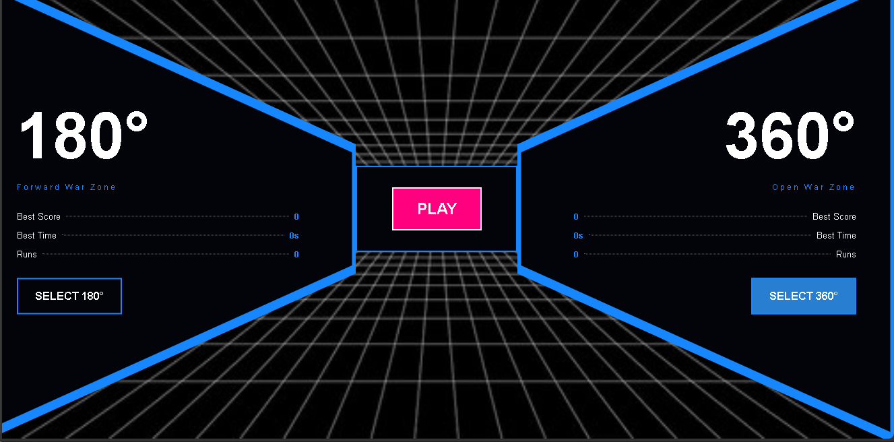
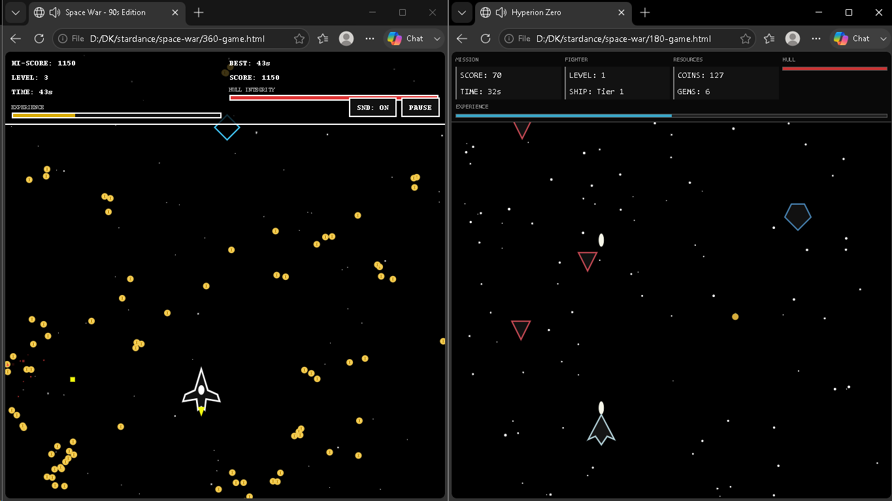
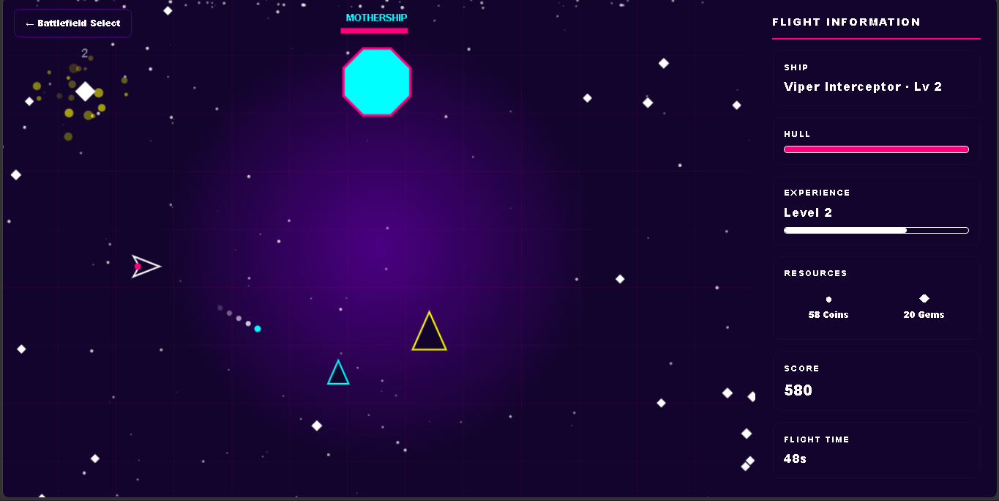

Space War

It is a browser-based space shooter, which I developed as a personal project without using any game engines.

Preview

The game has two modes:

180° War Zone - a front shooter with targeting, shooting, upgrades, enemy waves, and survival rate

360° War Zone - a full screen space shooter with targets coming from all directions with free movement, resources, upgrades, bosses, etc.

Enemies, collisions, projectiles, health, XP, level, upgrades, difficulty, visuals, audio, local leaderboard.

Players can track their own records and stats (kills, score, survived time) in their browsers’ local storage (no accounts, databases or any backend required).

Tech stack: HTML, CSS, JavaScript, Canvas, Web Audio API, localStorage

AI usage: I used AI to help me with some UI elements, visuals, CSS animations, and code optimizations. Apart from that everything else in the game logic, physics, calculations, progression system, enemies’ behavior, graphics, audio effects, and everything  – is coded by me.

Purpose: Learning how games work by building them from scratch, and have fun while doing that.
